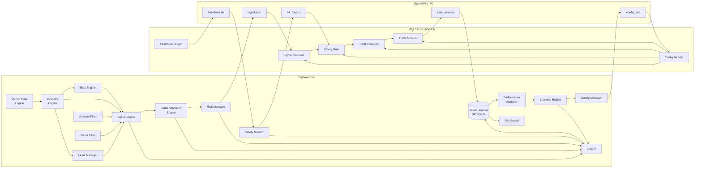

# Phase 3 — Architecture Flowchart (Mermaid)

## Complete System Lifecycle Flowchart

```mermaid
flowchart TD
    %% ─────────────────────────────────────────────
    %% PRE-MARKET & MARKET DATA
    %% ─────────────────────────────────────────────
    subgraph DATA["① Market Data & Pre-Processing"]
        A1([Daily Start / Bar Close]) --> A2[Market Data Engine\nFetch M5 · M15 · H1 bars\nValidate quality · Cache]
        A2 --> A3[Indicator Engine\nATR-5 · ATR-14 · EMA-20\nVWAP · Swing Points]
        A3 --> A4[Level Manager\nUpdate PDH·PDL · PWH·PWL\nAsian H·L · Daily·Weekly Open\nEqual Highs·Lows · OB·FVG zones\nMark mitigated zones]
    end

    %% ─────────────────────────────────────────────
    %% STRATEGY EVALUATION
    %% ─────────────────────────────────────────────
    subgraph STRATEGY["② Strategy Evaluation"]
        A4 --> B1[Bias Engine\nH1 BOS direction + EMA-20\nM15 BOS direction + EMA-20]
        B1 --> B2{Bias = BULLISH\nor BEARISH?}
        B2 -- NEUTRAL / H1≠M15 --> NOTRADEDAY([NO TRADE TODAY\nDisarm day · Log NEUTRAL_BIAS])
        B2 -- Directional --> B3[ADR Gate\nADR-14 ≥ 60 pips?\nIntraday range < 80% ADR?]
        B3 -- Gate fails --> NOTRADEDAY
        B3 -- Gate passes --> B4[Session Filter\n07:00–10:00 UTC\nor 12:00–15:00 UTC?]
        B4 -- Outside window --> WAIT([WAIT for session\nNo new entries])
        B4 -- Inside window --> B5[News Filter\n±15 min red EUR·USD event?\n±30 min NFP·FOMC·ECB?]
        B5 -- Blackout active --> WAIT
        B5 -- Clear --> B6[Signal Engine — Gate 1-2 ✓\nScan for Liquidity Sweep\nM5 low pierces level ≥ 2 pips\nAND closes back above within 2 bars]
        B6 -- No sweep --> WAIT
        B6 -- Sweep detected --> B7[Signal Engine — Gate 3 ✓\nDisplacement within 3 bars\nM5 range ≥ 1.5 × ATR-5?]
        B7 -- No displacement --> WAIT
        B7 -- Displacement ✓ --> B8[Signal Engine — Gate 4 ✓\nMSS: impulse body-closes\nbeyond last opposing M5 swing?]
        B8 -- No MSS --> WAIT
        B8 -- MSS ✓ --> B9[Signal Engine — Gate 5 ✓\nDefine entry zone\nOB: last down-close before impulse\nFVG: 3-candle gap\nGrade: A+ if both overlap]
        B9 -- No valid zone --> WAIT
        B9 -- Zone defined --> B10[Signal Engine — Gate 6 ✓\nPrice retraces into zone\nwithout breaking sweep extreme?]
        B10 -- Sweep extreme broken → setup dead --> WAIT
        B10 -- Retracement ✓ --> B11[Signal Engine — Gate 7 ✓\nConfirmation candle:\nBullish close inside·above zone midpoint?]
        B11 -- Not confirmed --> WAIT
        B11 -- Confirmed ✓ --> B12[Signal Engine — Gate 8 ✓\nCompute R:R to first logical pool\n≥ 1:2 with structural stop?\nNever move stop to force ratio]
        B12 -- R:R fails --> REJECT1([REJECT · Log POOR_RR])
        B12 -- R:R ≥ 1:2 ✓ --> SIG([SIGNAL emitted\nEntry · Stop · TP1 · TP2 · Grade · Zone])
    end

    %% ─────────────────────────────────────────────
    %% TRADE VALIDATION
    %% ─────────────────────────────────────────────
    subgraph VALIDATION["③ Trade Validation"]
        SIG --> C1[Trade Validation Engine\n§7 filter battery]
        C1 --> C2{Zone mitigated\nbefore this retest?}
        C2 -- Yes --> REJECT2([REJECT · STALE_ZONE])
        C2 -- No --> C3{Stop > 1.2 × ADR\nno-man's-land?}
        C3 -- Yes --> REJECT3([REJECT · STOP_OVEREXTENDED])
        C3 -- No --> C4{Structure choppy?\navg wick·body ratio > 2:1?}
        C4 -- Yes --> REJECT4([REJECT · CHOPPY_STRUCTURE])
        C4 -- No --> C5{Break was body-close\nnot just a wick?}
        C5 -- Wick only --> REJECT5([REJECT · WEAK_BREAK])
        C5 -- Body-close ✓ --> C6{Setup grade meets\ncurrent bar?\nA+ only if < 100 live trades}
        C6 -- Below bar --> REJECT6([REJECT · GRADE_BELOW_BAR])
        C6 -- Passes ✓ --> VALID([TRADE VALID\nPass to Risk Manager])
    end

    %% ─────────────────────────────────────────────
    %% RISK EVALUATION
    %% ─────────────────────────────────────────────
    subgraph RISK["④ Risk Evaluation + ⑤ Position Sizing"]
        VALID --> D1[Risk Manager — Kill-Switch Gate]
        D1 --> D2{Daily P·L ≤ −2%?}
        D2 -- Yes --> HALT1([HALT · DAILY_LIMIT_HIT\nPlatform off for day])
        D2 -- No --> D3{Weekly P·L ≤ −5%?}
        D3 -- Yes --> HALT2([HALT · WEEKLY_LIMIT_HIT\nOff for week])
        D3 -- No --> D4{Monthly P·L ≤ −6%?}
        D4 -- Yes --> HALT3([HALT · MONTHLY_LIMIT_HIT\nOff for month])
        D4 -- No --> D5{Drawdown from peak\n≥ 15%?}
        D5 -- Yes --> HALT4([CIRCUIT BREAKER\nFull halt · Manual reset required\nAlert: Telegram + email])
        D5 -- No --> D6{Consecutive losses ≥ 2?}
        D6 -- Yes --> HALT5([HALT · CONSEC_LOSS_LIMIT\nOff for day · 10-min screen-off])
        D6 -- No --> D7{Trades today ≥ 3?}
        D7 -- Yes --> HALT6([HALT · DAILY_TRADE_COUNT])
        D7 -- No --> D8{Volatility spike\ncooldown active?\nADR-14 > 1.5× 20-day MA}
        D8 -- Yes --> HALT7([WAIT · VOLATILITY_COOLDOWN\n4-hour timer])
        D8 -- No --> D9[Apply drawdown-based\nrisk reduction\n−5% DD → 0.25% · −10% → 0.125%]
        D9 --> D10[Position Sizing\nLots = Equity × adj_risk%\n÷ StopPips × PipValue\nRound down to lot step]
        D10 --> SIZED([SIZED SIGNAL\nDirection · Entry · Stop · TP1 · TP2\nLots · Risk% used · Grade])
    end

    %% ─────────────────────────────────────────────
    %% ORDER EXECUTION
    %% ─────────────────────────────────────────────
    subgraph EXECUTION["⑥ Order Execution (MQL5 EA)"]
        SIZED --> E1[EA Signal Dispatcher\nPython writes signed signal.json\nHMAC timestamp]
        E1 --> E2[EA Signal Receiver\nValidate HMAC + freshness\n< 90 seconds old?]
        E2 -- Stale·invalid --> REJECT7([REJECT · STALE_SIGNAL\nLog + discard])
        E2 -- Valid ✓ --> E3[EA Safety Gate\nCheck kill_flag file\nCheck local equity limits\nCheck position count = 0]
        E3 -- Gate blocked --> REJECT8([REJECT · EA_SAFETY_GATE])
        E3 -- Gate clear ✓ --> E4[EA Trade Executor\nOrderSend: Market order\nSL = sweep extreme + ATR-14 buffer\nTP1 pre-set · Lots from signal\nRetry up to 3× on requote]
        E4 -- Execution failed → 3 retries --> REJECT9([EXECUTION_FAILED\nLog + alert Safety Monitor])
        E4 -- Executed ✓ --> OPEN([POSITION OPEN\nLog: entry price · actual lots · slippage])
    end

    %% ─────────────────────────────────────────────
    %% TRADE MONITORING
    %% ─────────────────────────────────────────────
    subgraph MONITOR["⑦ Trade Monitoring (EA on every tick)"]
        OPEN --> F1{Dynamic invalidation?\nM5 body-close below\nsweep low · MSS level\nBEFORE TP1?}
        F1 -- Yes → thesis void --> F2[Exit at market immediately\nLog: DYNAMIC_INVALIDATION]
        F1 -- No --> F3{TP1 reached?\nPrice ≥ TP1 level}
        F3 -- Not yet --> F4{Time stop?\nNow ≥ 20:00 UTC?}
        F4 -- Yes --> F5[Close ALL positions at market\nLog: TIME_STOP]
        F4 -- No → continue monitoring --> F1
        F3 -- TP1 hit ✓ --> F6[Partial close: 50% of lots\nMove SL to Entry + 1 pip\nTrade cannot lose from here\nLog: TP1_HIT · BE_SET]
        F6 --> F7[Runner: trail stop\nbelow each new confirmed\nM5 swing low · favorable only]
        F7 --> F8{TP2 reached?\nor next opposing pool?\nor +3R?}
        F8 -- No → continue trailing --> F7
        F8 -- Yes --> F9[Close remaining 50%\nLog: TP2_HIT]
    end

    %% ─────────────────────────────────────────────
    %% TRADE CLOSING & JOURNAL
    %% ─────────────────────────────────────────────
    subgraph CLOSE["⑧ Trade Closing & Journal"]
        F2 --> G1
        F5 --> G1
        F9 --> G1
        G1[EA writes exec_event JSON\nto IPC exec_events/ folder]
        G1 --> G2[Python reads exec_event\nReconcile with open signal record]
        G2 --> G3[Trade Journal DB\nWrite full §11 record:\nAll journal fields · R-multiple\nCosts pips · Rule violation flag\nScreenshot path · Note]
    end

    %% ─────────────────────────────────────────────
    %% PERFORMANCE ANALYSIS
    %% ─────────────────────────────────────────────
    subgraph ANALYSIS["⑨ Performance Analysis"]
        G3 --> H1[Performance Analyzer\nWin rate · Avg R · Expectancy\nProfit factor · Max DD\nShortest·longest streak\nCost audit · Session × Grade × DOW\nRolling 20·50·100-trade windows]
        H1 --> H2[Write analytics snapshot\nto DB · JSON for Dashboard]
        H2 --> H3{Every 100 new\nlive trades?\nSample gate}
        H3 -- Not yet --> LOOP_BACK([Continue monitoring\nNext bar])
        H3 -- Yes → trigger learning --> LEARN
    end

    %% ─────────────────────────────────────────────
    %% LEARNING ENGINE
    %% ─────────────────────────────────────────────
    subgraph LEARNING["⑩ Learning Engine + ⑪ Knowledge Update"]
        LEARN([Learning Engine\nSafe-boundary analysis])
        LEARN --> I1[Bucket analysis\nSession × Grade × DOW × Bias\nFlag negative-expectancy buckets\nRequires ≥ 50 trades per bucket]
        I1 --> I2[Propose filter adjustments\nDisable bucket · Tighten choppy filter\nADR regime band · Grade bar]
        I2 --> I3{Out-of-sample test\nImprovement ≥ 0.05R\non held-out 30%?}
        I3 -- No improvement --> I4([No change · Log LEARNING_NO_ACTION])
        I3 -- Improvement confirmed --> I5[Write to pending_params\nFull rationale · before·after expectancy\n24-hour review window]
        I5 --> I6[Config Manager\nWrite new versioned config\nSign with HMAC\nAppend to config_history]
        I6 --> I7[EA Config Reader\nPick up new config on next poll\nValidate signature · Apply]
        I7 --> I8[Monitor next 50 trades\nCompare to pre-change baseline]
        I8 --> I9{Post-change performance\n≥ pre-change baseline?}
        I9 -- Degrades --> I10[ROLLBACK\nPromote previous config version\nLog ROLLBACK_TRIGGERED\nAlert user]
        I9 -- Holds or improves --> I11([Knowledge update confirmed\nLog PARAM_UPDATE_ACTIVE])
        I10 --> LOOP_BACK2([Continue with restored config])
        I11 --> LOOP_BACK2
        I4 --> LOOP_BACK2
    end

    %% ─────────────────────────────────────────────
    %% NEXT TRADE LOOP
    %% ─────────────────────────────────────────────
    LOOP_BACK --> A1
    LOOP_BACK2 --> A1

    %% ─────────────────────────────────────────────
    %% SAFETY MONITOR (parallel watchdog)
    %% ─────────────────────────────────────────────
    subgraph SAFETY["Safety Monitor — Parallel Watchdog (30-second cycle)"]
        SM1([Safety Monitor\n30-second heartbeat])
        SM1 --> SM2{EA heartbeat\nfile stale > 60s?}
        SM2 -- Yes --> SM3[Alert: Telegram·email\nAttempt EA restart script]
        SM2 -- No --> SM4{Kill-switch limit\nbreached at broker?\nEquity · DD · Monthly}
        SM4 -- Yes --> SM5[Write kill_flag.txt\nLog SAFETY_KILL\nAlert user]
        SM4 -- No --> SM6{News cache\n> 25 hours old?}
        SM6 -- Yes --> SM7[Critical alert\nLog STALE_NEWS_CACHE]
        SM6 -- No --> SM1
    end
```

---

## Module Interaction Map (simplified)

```mermaid
flowchart LR
    subgraph PYTHON["Python Core"]
        MDE[Market Data\nEngine]
        IE[Indicator\nEngine]
        BE[Bias Engine]
        LM[Level Manager]
        SF[Session Filter]
        NF[News Filter]
        SE[Signal Engine]
        TVE[Trade Validation\nEngine]
        RM[Risk Manager]
        CM[Config Manager]
        PA[Performance\nAnalyzer]
        LE[Learning Engine]
        DB[(Trade Journal\nDB SQLite)]
        LOG[Logger]
        SAF[Safety Monitor]
        DASH[Dashboard]
    end

    subgraph EA["MQL5 Execution EA"]
        ECR[Config Reader]
        ESR[Signal Receiver]
        ETE[Trade Executor]
        ETM[Trade Monitor]
        ESG[Safety Gate]
        EHL[Heartbeat Logger]
    end

    subgraph IPC["Signed File IPC"]
        SIG_F[signal.json]
        CFG_F[config.json]
        KILL_F[kill_flag.txt]
        HB_F[heartbeat.txt]
        EVT_F[exec_events/]
    end

    MDE --> IE --> BE & SE
    IE --> LM --> SE
    SF & NF --> SE
    BE --> SE --> TVE --> RM --> SIG_F
    CM --> CFG_F
    LE --> CM
    PA --> LE
    DB --> PA
    SAF --> KILL_F
    EHL --> HB_F --> SAF
    SIG_F --> ESR --> ESG --> ETE --> ETM --> EVT_F --> DB
    CFG_F --> ECR --> ESR & ETE & ETM & ESG
    KILL_F --> ESG
    DB --> DASH
    SE & TVE & RM & LE & SAF --> LOG --> DB
```
