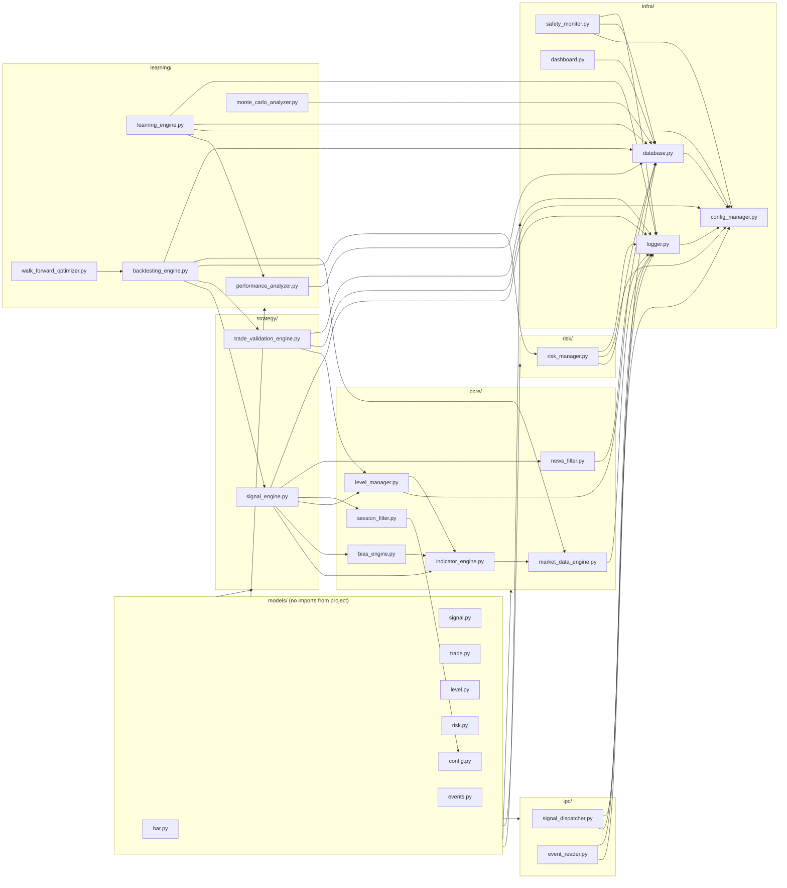

# Phase 5 — Implementation Plan

## 1. Project Folder Structure

```
tradebotflow/
│
├── config/
│   ├── system.json               # Active system config (HMAC-signed at write time)
│   ├── system.schema.json        # JSON Schema — Config Manager validates against this
│   ├── holidays.json             # London + NY bank holiday calendar (user-approved list)
│   └── .env.example              # Template: HMAC_SECRET, BROKER_*, DB_PATH
│
├── python/
│   ├── main.py                   # Live trading entry point
│   ├── backtest_runner.py        # Backtest / walk-forward entry point (CLI)
│   │
│   ├── models/                   # Shared immutable data types — no business logic here
│   │   ├── bar.py                # OHLCVBar, BarSeries
│   │   ├── signal.py             # Signal, SetupGrade(enum), BiasState(enum)
│   │   ├── trade.py              # TradeRecord, TradeOutcome(enum), TradeStatus(enum)
│   │   ├── level.py              # PriceLevel, Zone, ZoneType(enum), MitigationState(enum)
│   │   ├── risk.py               # SizingResult, KillSwitchReason(enum), RiskState
│   │   ├── config.py             # SystemConfig, MMConfig, LearningConfig, SessionConfig
│   │   └── events.py             # ExecEvent, SignalEvent, LearningEvent (IPC + audit types)
│   │
│   ├── core/                     # Market data · indicators · context
│   │   ├── market_data_engine.py
│   │   ├── indicator_engine.py
│   │   ├── bias_engine.py
│   │   ├── level_manager.py
│   │   ├── session_filter.py
│   │   └── news_filter.py
│   │
│   ├── strategy/                 # Signal generation · trade validation
│   │   ├── signal_engine.py
│   │   └── trade_validation_engine.py
│   │
│   ├── risk/
│   │   └── risk_manager.py
│   │
│   ├── learning/                 # Analysis · adaptation · research
│   │   ├── performance_analyzer.py
│   │   ├── learning_engine.py
│   │   ├── backtesting_engine.py
│   │   ├── walk_forward_optimizer.py
│   │   └── monte_carlo_analyzer.py
│   │
│   ├── infra/                    # Infrastructure — no trading logic
│   │   ├── config_manager.py
│   │   ├── database.py           # SQLite DAO layer
│   │   ├── logger.py
│   │   ├── safety_monitor.py
│   │   └── dashboard.py
│   │
│   ├── ipc/                      # File-based IPC with MQL5 EA
│   │   ├── signal_dispatcher.py  # Python → EA: writes signal.json
│   │   └── event_reader.py       # EA → Python: reads exec_events/
│   │
│   └── tests/
│       ├── conftest.py           # Shared fixtures
│       ├── unit/
│       │   ├── test_indicator_engine.py
│       │   ├── test_bias_engine.py
│       │   ├── test_level_manager.py
│       │   ├── test_session_filter.py
│       │   ├── test_news_filter.py
│       │   ├── test_signal_engine.py
│       │   ├── test_trade_validation.py
│       │   ├── test_risk_manager.py
│       │   ├── test_performance_analyzer.py
│       │   ├── test_learning_engine.py
│       │   └── test_config_manager.py
│       ├── integration/
│       │   ├── test_signal_pipeline.py   # bar → signal → dispatch full path
│       │   ├── test_backtest_engine.py
│       │   └── test_ipc_roundtrip.py     # dispatcher ↔ event_reader
│       └── stress/
│           ├── test_memory_24h.py        # Run live loop for 24h sim, measure peak RAM
│           ├── test_cpu_sustained.py     # Measure CPU at sustained M5 bar rate
│           └── test_db_write_volume.py   # Simulate 500 trades, check write latency
│
├── mql5/
│   ├── Experts/
│   │   └── TradeBotFlow/
│   │       └── TradeBotFlow.mq5          # EA entry point (OnInit · OnTick · OnTimer)
│   └── Include/
│       └── TradeBotFlow/
│           ├── CConfigReader.mqh
│           ├── CSignalReceiver.mqh
│           ├── CTradeExecutor.mqh
│           ├── CTradeMonitor.mqh
│           ├── CSafetyGate.mqh
│           └── CHeartbeatLogger.mqh
│
├── ipc/                          # Shared VPS local directory (both processes access)
│   ├── signal.json               # Current pending signal (written by Python, cleared by EA)
│   ├── config.json               # Active system config for EA (HMAC-signed)
│   ├── kill_flag.txt             # Exists only when Safety Monitor triggers a halt
│   ├── heartbeat.txt             # EA writes timestamp every 30s
│   └── exec_events/              # EA writes one JSON per execution event
│
├── data/
│   ├── cache/                    # Binary bar cache (numpy .npy or parquet)
│   └── historical/               # Raw historical M5 data (CSV source)
│
├── logs/
│   ├── signal/                   # Rotated daily, retained 30 days
│   ├── trade/
│   ├── risk/
│   ├── learning/
│   ├── system/
│   └── audit/                    # IMMUTABLE — never rotated
│
├── scripts/
│   ├── setup_vps.py              # VPS dependency installer + directory scaffold
│   ├── download_historical.py    # Fetch 2-3yr M5 history from broker or Dukascopy
│   └── export_to_excel.py        # Export DB → companion workbook format
│
├── docs/                         # Phase deliverables (already populated)
├── requirements.txt
└── README.md
```

---

## 2. Class Diagram (core data models + key service classes)

```mermaid
classDiagram

    %% ── Enumerations ──────────────────────────────────────────
    class BiasState {
        <<enumeration>>
        BULLISH
        BEARISH
        NEUTRAL
    }

    class SetupGrade {
        <<enumeration>>
        A_PLUS
        STANDARD
    }

    class ZoneType {
        <<enumeration>>
        ORDER_BLOCK
        FAIR_VALUE_GAP
        OB_FVG_OVERLAP
    }

    class TradeOutcome {
        <<enumeration>>
        WIN_TP1_AND_TP2
        WIN_TP1_RUNNER_TS
        WIN_TP1_TIME_STOP
        BREAKEVEN
        LOSS_SL
        LOSS_DYNAMIC_INVALIDATION
        LOSS_TIME_STOP
    }

    class KillSwitchReason {
        <<enumeration>>
        DAILY_LIMIT
        WEEKLY_LIMIT
        MONTHLY_LIMIT
        CIRCUIT_BREAKER
        CONSEC_LOSS
        TRADE_COUNT
        SESSION_CLOSED
        VOLATILITY_COOLDOWN
    }

    %% ── Core Data Models ──────────────────────────────────────
    class OHLCVBar {
        +datetime time_utc
        +float open
        +float high
        +float low
        +float close
        +int tick_volume
        +is_bullish() bool
        +body_size() float
        +wick_ratio() float
        +range_size() float
    }

    class Zone {
        +ZoneType zone_type
        +float proximal_edge
        +float distal_edge
        +datetime formed_at
        +bool is_mitigated
        +str sweep_level_name
        +midpoint() float
        +contains(price) bool
    }

    class Signal {
        <<dataclass, frozen>>
        +BiasState bias
        +str direction
        +SetupGrade grade
        +float entry_price
        +float stop_price
        +float tp1_price
        +float tp2_price
        +float stop_pips
        +float planned_rr
        +Zone entry_zone
        +str sweep_level_name
        +datetime signal_time_utc
        +float displacement_atr_ratio
    }

    class SizingResult {
        <<dataclass, frozen>>
        +float lots
        +float risk_pct_used
        +float adj_risk_pct
        +str drawdown_reduction_applied
        +KillSwitchReason block_reason
        +bool is_blocked
    }

    class TradeRecord {
        +int trade_id
        +datetime date
        +str day_of_week
        +str session
        +str direction
        +bool bias_aligned
        +SetupGrade setup_grade
        +str sweep_level
        +datetime entry_time
        +float entry_price
        +float stop_price
        +float tp2_price
        +float risk_pct
        +float stop_pips
        +float planned_rr
        +bool tp1_hit
        +float runner_exit_price
        +datetime exit_time
        +TradeOutcome outcome
        +float modelled_r
        +float r_used
        +float pl_pct
        +float cum_r
        +float costs_pips
        +bool rule_violation
        +str note
        +realized_r() float
    }

    %% ── Service Classes ───────────────────────────────────────
    class MarketDataEngine {
        -_cache: dict
        -_feed: AbstractMarketDataFeed
        +get_bars(timeframe, count) BarSeries
        +subscribe_bar_close(callback) void
        +latest_bar(timeframe) OHLCVBar
    }

    class IndicatorEngine {
        -_lru_cache: LRUCache
        +atr(bars, period, wilder) float
        +avg_range(bars, period) float
        +ema(bars, period) float
        +vwap(bars) float
        +swing_highs(bars, lookback) list~float~
        +swing_lows(bars, lookback) list~float~
    }

    class BiasEngine {
        -_cached_bias: BiasState
        -_last_h1_bar: int
        +compute(h1_bars, m15_bars) BiasState
        +is_armed() bool
    }

    class LevelManager {
        -_levels: dict
        -_zones: list~Zone~
        -_dao: TradeJournalDAO
        +pdh() float
        +pdl() float
        +pwh() float
        +pwl() float
        +asian_high() float
        +asian_low() float
        +daily_open() float
        +active_zones() list~Zone~
        +register_zone(zone) void
        +check_mitigation(bars) void
        +find_sweep_target(direction) PriceLevel
    }

    class SessionFilter {
        -_sessions: list~SessionWindow~
        -_holidays: set~date~
        +is_tradeable(utc_dt) bool
        +is_hard_close(utc_dt) bool
        +minutes_to_close(utc_dt) int
    }

    class NewsFilter {
        -_events: list~NewsEvent~
        -_last_fetch: datetime
        +is_blackout(utc_dt) bool
        +refresh_cache() void
        +next_event(utc_dt) NewsEvent
    }

    class SignalEngine {
        -_indicator_engine: IndicatorEngine
        -_bias_engine: BiasEngine
        -_level_manager: LevelManager
        -_session_filter: SessionFilter
        -_news_filter: NewsFilter
        +evaluate(m5_bars, m15_bars, h1_bars) Signal
        -_check_sweep(bars) bool
        -_check_displacement(bars) bool
        -_check_mss(bars) bool
        -_define_zone(bars) Zone
        -_check_retracement(bars, zone) bool
        -_check_confirmation(bars, zone) bool
        -_check_rr(signal) bool
    }

    class TradeValidationEngine {
        -_level_manager: LevelManager
        -_config: SystemConfig
        +validate(signal, bars) tuple~bool,str~
        -_zone_mitigated(zone) bool
        -_stop_in_no_mans_land(signal) bool
        -_structure_choppy(bars) bool
        -_break_is_body_close(bars) bool
        -_grade_meets_bar(grade, trade_count) bool
    }

    class RiskManager {
        -_dao: TradeJournalDAO
        -_config: MMConfig
        -_equity_peak: float
        +check_gate(current_equity) SizingResult
        +compute_size(equity, stop_pips, pip_value) SizingResult
        +record_trade_result(outcome_r) void
        -_drawdown_reduction_factor(equity) float
        -_volatility_cooldown_active() bool
        +reset_circuit_breaker() void
    }

    class LearningEngine {
        -_analyzer: PerformanceAnalyzer
        -_config_manager: ConfigManager
        -_dao: TradeJournalDAO
        +run_cycle() LearningDecision
        -_analyze_buckets() list~BucketResult~
        -_propose_adjustments(buckets) list~Proposal~
        -_validate_out_of_sample(proposal) bool
        -_apply_proposal(proposal) void
        -_check_rollback() void
    }

    class ConfigManager {
        -_config: SystemConfig
        -_hmac_key: bytes
        -_dao: TradeJournalDAO
        +get() SystemConfig
        +update(new_config) void
        +sign(data) str
        +verify(data, sig) bool
        +write_ea_config() void
        +rollback_to_version(version_id) void
    }

    class SignalDispatcher {
        -_ipc_path: Path
        -_config_manager: ConfigManager
        +dispatch(signal, sizing) void
        +clear() void
        -_sign_payload(payload) dict
    }

    class SafetyMonitor {
        -_interval_s: int
        -_alerter: Alerter
        +start() void
        +stop() void
        -_check_heartbeat() void
        -_check_equity_limits() void
        -_check_news_cache() void
        -_write_kill_flag() void
    }

    %% ── Relationships ─────────────────────────────────────────
    SignalEngine --> IndicatorEngine
    SignalEngine --> BiasEngine
    SignalEngine --> LevelManager
    SignalEngine --> SessionFilter
    SignalEngine --> NewsFilter
    SignalEngine ..> Signal : emits

    TradeValidationEngine --> LevelManager
    TradeValidationEngine ..> Signal : validates

    RiskManager ..> SizingResult : returns
    RiskManager --> TradeJournalDAO

    LearningEngine --> PerformanceAnalyzer
    LearningEngine --> ConfigManager
    LearningEngine --> TradeJournalDAO

    ConfigManager --> SignalDispatcher
    SafetyMonitor --> ConfigManager

    TradeRecord --> TradeOutcome
    Signal --> Zone
    Signal --> BiasState
    Signal --> SetupGrade
    Zone --> ZoneType
    SizingResult --> KillSwitchReason
```



---

## 3. Module Dependency Diagram



---

## 4. Execution Sequences

### 4a. Startup Sequence

```
[STARTUP]
 1. Load .env → HMAC_SECRET, DB_PATH, IPC_PATH, BROKER_*
 2. ConfigManager.init()
    ├── Load + validate system.json against schema
    ├── Verify HMAC signature on file
    └── Populate SystemConfig dataclass
 3. Logger.init() → start async writer thread, open log channels
 4. TradeJournalDAO.init() → connect SQLite, run schema migrations if needed
 5. LevelManager.restore() → load persisted levels + zones from DB
 6. NewsFilter.refresh_cache() → HTTP fetch today's calendar
 7. MarketDataEngine.connect() → broker feed or historical file
 8. MarketDataEngine.warm_up(bars=200) → pre-load M5/M15/H1 history
 9. IndicatorEngine.precompute(warm_up_bars) → populate LRU cache
10. BiasEngine.compute(h1_bars, m15_bars) → initial bias
11. SafetyMonitor.start() → background watchdog thread
12. SignalDispatcher.write_config() → write HMAC-signed config.json for EA
13. EventReader.start() → background thread watching exec_events/
14. Main event loop: subscribe to MarketDataEngine bar-close events
15. LOG[SYSTEM] → "System armed. Bias={bias}. ADR={adr:.1f}. Day armed={armed}"
```

### 4b. Live Trading Loop (per M5 bar-close)

```
[PER M5 BAR CLOSE]
 1. MarketDataEngine fires bar-close callback
 2. IndicatorEngine updates cached values for new bar
 3. LevelManager.update()
    ├── At 00:00 UTC → roll PDH/PDL, Weekly open (Monday), lock Asian range (07:00)
    └── Check equal highs/lows, mark mitigated zones
 4. If H1 bar also closed → BiasEngine.recompute(h1_bars, m15_bars)
 5. signal = SignalEngine.evaluate(m5_bars, m15_bars, h1_bars)
    └── Returns None if any gate fails (short-circuit, log rejection reason)
 6. If signal is None → return (sleep until next bar)
 7. (valid, reason) = TradeValidationEngine.validate(signal, m5_bars)
    └── If not valid → LOG[SIGNAL] REJECTED reason, return
 8. sizing = RiskManager.check_gate(current_equity)
    └── If sizing.is_blocked → LOG[RISK] HALTED sizing.block_reason, return
 9. sizing = RiskManager.compute_size(equity, signal.stop_pips, pip_value)
10. SignalDispatcher.dispatch(signal, sizing)
    └── Writes HMAC-signed signal.json to ipc/
11. LOG[SIGNAL] DISPATCHED signal_id grade entry stop tp1 tp2 lots risk_pct
12. [EA independently reads + executes — see EA sequence below]
```

### 4c. EA Execution Sequence (MQL5, per M5 bar or tick)

```
[EA — OnTick / bar-close detection]
 1. CSafetyGate.Check()
    ├── kill_flag.txt exists? → block + log
    ├── Local equity loss > daily limit? → block + log
    └── Position count > 0? → skip signal check (monitor only)
 2. CSignalReceiver.Poll()
    ├── mtime of signal.json changed since last read?
    ├── If yes → read + parse JSON
    ├── Verify HMAC
    ├── Check timestamp age < 90s
    └── If any check fails → discard + log
 3. CTradeExecutor.Execute(signal)
    ├── Compute lot size (already in signal, EA verifies it ≤ broker max)
    ├── Set SL = signal.stop_price
    ├── OrderSend(market order, lots, SL)
    ├── On success → clear signal.json, write exec_event OPENED
    └── On failure → retry ≤ 3×, then write exec_event EXEC_FAILED
 4. CSignalReceiver.Clear() → delete/zero signal.json

[EA — OnTick while position open]
 5. CTradeMonitor.Manage()
    ├── Check dynamic invalidation → close at market if triggered
    ├── Check TP1 hit → partial close 50%, modify SL to BE+1pip
    ├── If runner active: check new M5 swing low, trail stop if higher
    ├── Check TP2 / +3R → close remainder
    └── Check time ≥ 20:00 UTC → close all

[EA — OnTimer, every 30s]
 6. CHeartbeatLogger.WriteHeartbeat()
```

### 4d. Trade Close & Learning Sequence

```
[TRADE CLOSES]
 1. EA writes exec_event JSON to ipc/exec_events/
 2. EventReader (Python background thread) picks up file
 3. EventReader → TradeJournalDAO.record_trade(trade_record)
 4. PerformanceAnalyzer.run() → recompute all metrics + bucket breakdowns
 5. PerformanceAnalyzer → write analytics snapshot to DB
 6. RiskManager.record_trade_result(outcome_r)
    └── Update consecutive-loss counter, daily P/L, monthly P/L, equity peak
 7. LearningEngine.check_trigger()
    └── If new_trades_since_last_cycle >= 100 → LearningEngine.run_cycle()
        ├── Analyze buckets (session × grade × DOW × bias)
        ├── Identify negative-expectancy buckets (≥ 50 trade sample)
        ├── Validate improvement on held-out 30%
        ├── If improvement ≥ 0.05R → write pending_params, schedule 24h review
        └── After 24h → ConfigManager.update() → write_ea_config()
```

---

## 5. Naming Conventions

### Python

| Element | Convention | Example |
|---|---|---|
| File name | `snake_case.py` | `signal_engine.py` |
| Class | `PascalCase` | `SignalEngine` |
| Method / function | `snake_case` | `evaluate_gate_3()` |
| Private method | `_snake_case` | `_check_displacement()` |
| Constant | `UPPER_SNAKE_CASE` | `MIN_SWEEP_PIPS = 2.0` |
| Enum class | `PascalCase` | `BiasState` |
| Enum member | `UPPER_SNAKE_CASE` | `BiasState.BULLISH` |
| Dataclass field | `snake_case` | `stop_pips: float` |
| Type alias | `PascalCase` | `PipValue = float` |
| Module-level logger | `log` | `log = logging.getLogger(__name__)` |
| Test function | `test_<what>_<condition>` | `test_sweep_returns_false_when_gap_too_small()` |

### MQL5

| Element | Convention | Example |
|---|---|---|
| File name | `CPascalCase.mqh` | `CTradeExecutor.mqh` |
| Class | `C` prefix + `PascalCase` | `CTradeMonitor` |
| Method | `PascalCase` | `ManageOpenPosition()` |
| Member variable | `m_` + `camelCase` | `m_lastSignalAge` |
| Local variable | `camelCase` | `entryPrice` |
| Constant | `UPPER_SNAKE_CASE` | `MAX_RETRY_COUNT` |
| Enum | `E_` + `PascalCase` | `E_TradeState` |
| Input parameter | `Inp` + `PascalCase` | `InpMagicNumber` |
| Event handler | `On` + `PascalCase` | `OnTick()`, `OnTimer()` |

---

## 6. Coding Standards

### Python (3.11+)

**Type safety**
- All function signatures have full type hints (params + return type).
- Use `from __future__ import annotations` for forward references.
- `dataclass(frozen=True)` for all immutable DTOs (Signal, SizingResult, OHLCVBar).
- `dataclass(frozen=False)` only for objects that legitimately mutate (Zone, TradeRecord).
- Abstract base classes (`abc.ABC`) for every interface that has > 1 implementation (e.g., `AbstractMarketDataFeed`, `AbstractAlerter`).

**Immutability discipline**
- No mutable default arguments. Use `field(default_factory=...)` in dataclasses.
- `datetime` objects are always UTC-aware: `datetime.now(timezone.utc)`.
- All file paths use `pathlib.Path` (never `os.path` string concatenation).

**Size and complexity limits**
- Max function body: 40 lines. Split into private helpers if exceeded.
- Max class: 200 lines (excluding docstrings). Split by responsibility if exceeded.
- Max parameters per function: 5. Use a dataclass if more are needed.
- Nesting depth: ≤ 3 levels. Flatten with guard clauses.

**Error handling**
- No bare `except:`. Always catch specific exceptions.
- Business-logic failures (gate not met, zone not found) return a typed result, never raise.
- Exceptional failures (DB unavailable, network down) raise custom exceptions that propagate to the main loop's recovery handler.
- Custom exceptions live in `python/infra/exceptions.py`.

**Logging**
- Never use `print()` in production paths. All output goes through the centralized Logger.
- Every signal decision (pass/fail) is logged with a structured payload at INFO level.
- Every learning decision and config change is logged at AUDIT level (immutable channel).

**Dependencies**
- `stdlib` first, then third-party.
- Third-party allowed: `numpy` (indicator math), `scipy` (Monte Carlo / stats), `requests` (news calendar), `pytest` (tests), `sqlite3` (stdlib — no ORM).
- No pandas in the live trading path (avoid GIL + memory overhead); numpy arrays only for bar series.
- Pandas is allowed in `learning/` and `scripts/` (offline analysis and export only).

**Testing**
- Every public method has at least one unit test.
- Unit tests are deterministic (no random, no network, no filesystem — use fixtures and mocks).
- Integration tests may use an in-memory SQLite DB and a mock data feed.
- Stress tests run in a subprocess with memory profiling.

### MQL5

- One class per `.mqh` file; EA entry point (`TradeBotFlow.mq5`) only wires instances together.
- No global variables except the six class instances declared at file scope in the EA.
- Every `OrderSend` return value is checked; non-zero error → log + alert.
- One unique `InpMagicNumber` per EA instance (configurable input) — used to filter all position queries.
- No `Sleep()` calls on the main thread.
- File I/O uses `FileOpen()`/`FileClose()` with explicit error checks; never assume success.

---

## 7. Memory Optimization Plan

| Component | Strategy | Target |
|---|---|---|
| **Bar series rolling windows** | M5: 200 bars (~17h), M15: 100 bars (~25h), H1: 50 bars — configurable, held as fixed-size `numpy` circular arrays | < 500KB total |
| **Indicator LRU cache** | Max 500 entries keyed by `(timeframe, indicator, period, bar_index)`. Evict least-recently-used on overflow. | < 2MB |
| **Level Manager zones** | Max 50 stored zones per ZoneType; oldest evicted when limit reached. Mitigated zones pruned immediately. | < 50KB |
| **News cache** | One day's events (< 10 events typically). Dict in memory, refreshed daily. | < 5KB |
| **Signal history** | Last 200 signals (pass + fail) held in a `deque(maxlen=200)`. Older signals in DB only. | < 100KB |
| **SQLite** | WAL mode + page size 4096 + `PRAGMA cache_size = 2000`. Max 3 concurrent connections via a thread-local connection pool. | < 32MB |
| **Async log queue** | `queue.Queue(maxsize=1000)`. On overflow: drop oldest, increment `log_drops` counter. | < 5MB |
| **Lazy imports** | `BacktestingEngine`, `WalkForwardOptimizer`, `MonteCarloAnalyzer` not imported in `main.py`. Loaded on demand in `backtest_runner.py` only. | 0MB in live mode |
| **Peak live RAM target** | All live-trading components combined | **< 256MB** |
| **Backtest RAM** | May use up to 2GB for full 3-year M5 dataset; runs as separate process | Isolated |

---

## 8. Performance Optimization Plan

| Concern | Strategy |
|---|---|
| **Signal evaluation frequency** | Runs only on M5 bar-close (288 times/day). Never triggered intra-bar. Zero wasted CPU between bars. |
| **BiasEngine recompute** | Only runs when H1 or M15 bar also closes (~96 and ~288 times/day respectively). Cached between bar-closes. |
| **LevelManager dynamic updates** | Only updates equal-highs/lows when a new M5 swing point forms. Mitigation check runs on bar-close only. |
| **SessionFilter** | Pure UTC datetime arithmetic (<1μs). No caching needed; no I/O. |
| **IndicatorEngine** | Compute-on-demand + LRU cache. If `(timeframe, indicator, period, bar_index)` already cached → return immediately. New bars invalidate only the current-bar cache entry, not the full history. |
| **IPC file reads** | `os.stat()` mtime check before `open()` + `json.load()`. If mtime unchanged → skip parse. Avoids unnecessary JSON deserialization on every EA poll. |
| **NewsFilter HTTP fetch** | Single HTTP request at 00:00 UTC per day. All `is_blackout()` calls during the day are pure in-memory dict lookups. Degrades gracefully (use stale cache) on network failure. |
| **Database writes** | `exec_event` files from EA arrive in a burst at trade close. EventReader batches events arriving within a 2-second window into a single `BEGIN...COMMIT` transaction. |
| **Signal path thread isolation** | The critical path (bar → signal → dispatch) runs on a single thread. `PerformanceAnalyzer`, `SafetyMonitor`, and `Logger` run on separate threads. No lock contention on the signal path. |
| **EA on-tick performance** | `CTradeMonitor.Manage()` exits immediately if no position is open. `CSignalReceiver.Poll()` exits immediately if `signal.json` mtime has not changed since last poll. |
| **Target signal-path latency** | M5 bar-close → `signal.json` written: **< 100ms** (non-critical; EA is also bar-close driven, so a few hundred ms tolerance exists) |

---

## 9. Implementation Order (Phase 6 coding sequence)

Modules will be implemented in this exact dependency order — lowest-level first, no module coded before its dependencies are complete and tested.

| Wave | Modules | Rationale |
|---|---|---|
| **Wave 1** | `models/` (all) · `infra/logger.py` · `infra/config_manager.py` | Zero dependencies; everything else imports from here |
| **Wave 2** | `infra/database.py` (DAO + schema) | Depends only on models |
| **Wave 3** | `core/market_data_engine.py` · `core/indicator_engine.py` | Foundation for all strategy modules |
| **Wave 4** | `core/session_filter.py` · `core/news_filter.py` | Stateless utilities; easy to test in isolation |
| **Wave 5** | `core/level_manager.py` · `core/bias_engine.py` | Depend on indicator engine + DAO |
| **Wave 6** | `strategy/signal_engine.py` | Depends on all of Wave 3–5 |
| **Wave 7** | `strategy/trade_validation_engine.py` | Depends on signal engine + level manager |
| **Wave 8** | `risk/risk_manager.py` | Depends on DAO + config; independent of signal path |
| **Wave 9** | `ipc/signal_dispatcher.py` · `ipc/event_reader.py` | Depends on config manager + DAO |
| **Wave 10** | `infra/safety_monitor.py` | Depends on config, DAO, IPC |
| **Wave 11** | `learning/performance_analyzer.py` | Depends on DAO |
| **Wave 12** | `learning/backtesting_engine.py` | Integrates signal + validation + risk in replay mode |
| **Wave 13** | `learning/learning_engine.py` | Depends on analyzer + config |
| **Wave 14** | `learning/walk_forward_optimizer.py` · `learning/monte_carlo_analyzer.py` | Depends on backtesting engine + DAO |
| **Wave 15** | `main.py` (live trading entry point) | Wires all Python modules |
| **Wave 16** | MQL5: `CConfigReader` + `CSafetyGate` + `CHeartbeatLogger` | EA foundation; no trade logic yet |
| **Wave 17** | MQL5: `CSignalReceiver` + `CTradeExecutor` | EA execution path |
| **Wave 18** | MQL5: `CTradeMonitor` + `TradeBotFlow.mq5` (wiring) | Complete EA |
| **Wave 19** | `infra/dashboard.py` · `scripts/` | Non-critical utilities; can run parallel to Wave 18 |
| **Wave 20** | All `tests/` suites (unit → integration → stress) | Final validation before demo deployment |

Each wave = one Phase 6 module iteration: explain → implement → test → edge cases → await approval.
